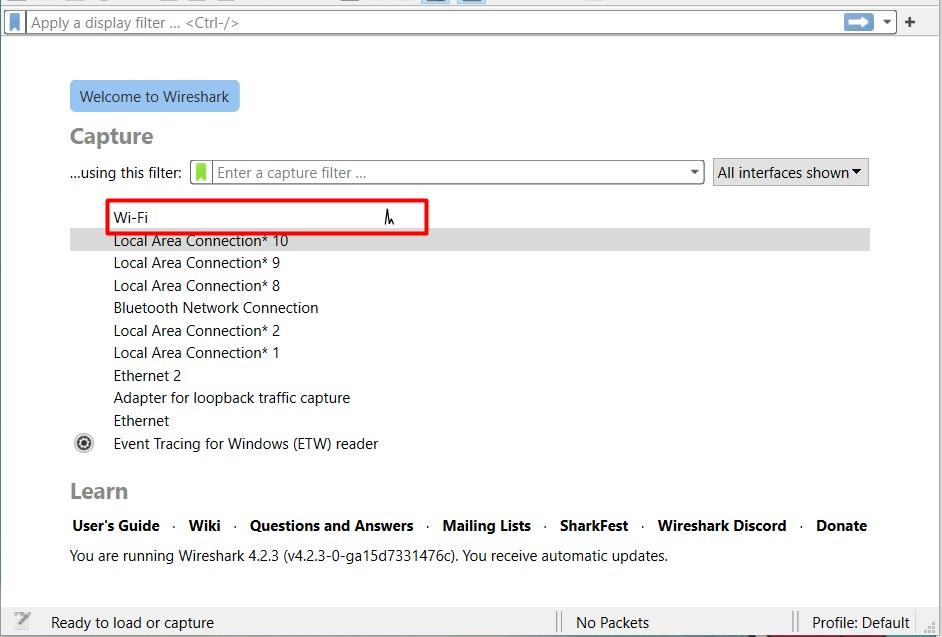
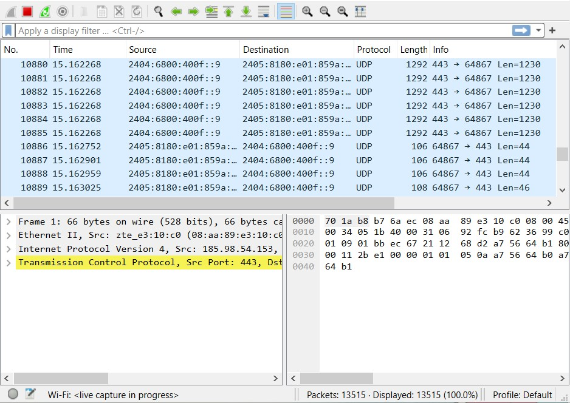
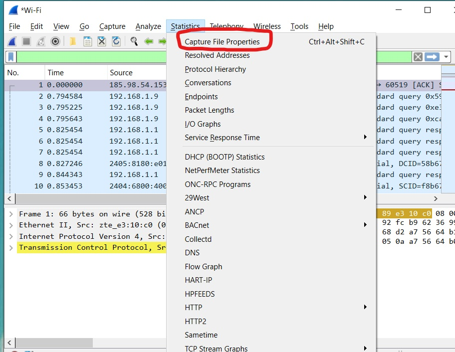
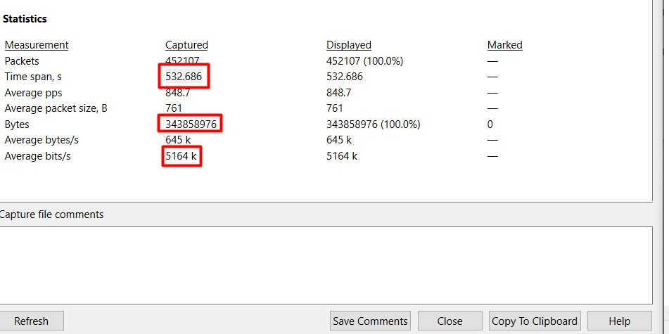

# Pengukuran QoS Throughput, Packet Loss, Delay dan Jitter menggunakan Wireshark

## Penjelasan tentang Wireshark

  

Wireshark adalah perangkat lunak analisis jaringan yang memungkinkan pengguna untuk memonitor, menganalisis, dan memecahkan masalah dalam lalu lintas jaringan dengan cara yang mendetil, melalui kemampuannya untuk merekam dan menganalisis paket data yang dikirim dan diterima dalam suatu jaringan komputer.

## Menjalankan pengukuran
Untuk mendapatkan parameter Time di Wireshark, kalian terlebih dahulu menonton youtube atau bermain game online. Disini saya menonton youtube selama 10 menit untuk mendapatkan parameter Time.

#### 1. Buka Wireshark dan pilih wifi lalu buka youtube dan tonton sampai waktu yang ditentukan.

#### 2. Lalu buka Wireshark lagi dan data-data parameter akan keluar, dari Time, Source, Destination dan lainnya.

#### 3. Lalu kita akan mengukur `Throughput`, untuk melihat time span dan bytes kita harus pergi ke statistics lalu `Capture File Properties`

#### 4. Lalu, kita catat time span dan bytes, dan kita cari maka nanti hasilnya akan sama dengan Avarage bits/s

#### 5. Kita cari dengan rumus seperti dibawah ini

