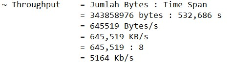

# Pengukuran QoS Throughput, Packet Loss, Delay dan Jitter menggunakan Wireshark

## Penjelasan tentang Wireshark

  

Wireshark adalah perangkat lunak analisis jaringan yang memungkinkan pengguna untuk memonitor, menganalisis, dan memecahkan masalah dalam lalu lintas jaringan dengan cara yang mendetil, melalui kemampuannya untuk merekam dan menganalisis paket data yang dikirim dan diterima dalam suatu jaringan komputer.

## Menjalankan pengukuran
Untuk mendapatkan parameter Time di Wireshark, kalian terlebih dahulu menonton youtube atau bermain game online. Disini saya menonton youtube selama 10 menit untuk mendapatkan parameter Time.

#### 1. Buka Wireshark dan pilih wifi lalu buka youtube dan tonton sampai waktu yang ditentukan.

#### 2. Lalu buka Wireshark lagi dan data-data parameter akan keluar, dari Time, Source, Destination dan lainnya.

#### 3. Lalu kita akan mengukur `Throughput`, untuk melihat `time span dan bytes` kita harus pergi ke statistics lalu `Capture File Properties`.

#### 4. Lalu, kita catat `time span dan bytes`, dan kita cari maka nanti hasilnya akan sama dengan Avarage bits/s.

#### 5. Kita cari dengan rumus seperti dibawah ini.

#### 6. Sekarang kita akan melihat 'Packet Loss' dengan cara ketik pada wireshark `tcp.analysis.lost_segment' maka data packet loss akan keluar kemudian kalian hitung untuk menghitung rata-rata dari packet loss.

#### 7. Untuk melihat keseluruhan packet kalian pergi ke statistic dan lihat jumlah packet disana.

#### 8. lalu hitung packet loss dengan rumus seperti dibawah ini.

#### 9. Oke selanjutnya kita akan menghitung `Delay`, dengan cara kita ketik di wireshark `tcp` maka data-data akan terfilter. Lalu pilih `File` pilih `Export Packet Dissections` dan `pilih As CSV` agar mempermudah menghitung delay.

#### 10. Disini data-data nya ada `Time, Source, Destination, Protocol, Length, Info` dan terlihat berantakan, kalian atur terlebih dahulu dan kita hanya memerlukan data dari Time.

#### 11. Lalu kita buat `Time1, Time2 dan Delay` Time1 kita ambil dari Time, Time2 kita ambil dari Time waktu ke 2, dan untuk mencari Delay dengan cara Time2 dikurang Time1.

#### 12. Untuk mencari Total Delay kita jumlahkan seluruh delay, dan untuk mencari Rata-rata Delay dengan cara Total Delay dibagi dengan Paket Diterima.

#### 13. Oke, selanjutnya kita akan menghitung `Jitter`, kita harus membuat `Delay1, Delay2 dan Jitter` Delay1 kita ambil dari nilai Delay waktu yang pertama dikurangi dengan Delay waktu kedua, Delay2 kita ambil dari nilai Delay waktu yang kedua, dan Jitter hasil dari Delay2 dikurang Delay1.

#### 14. Untuk mencari Total Jitter kita jumlahkan seluruh Jitter, dan untuk mencari Rata-rata Jitter dengan cara Total Delay dibagi dengan Paket Diterima.

